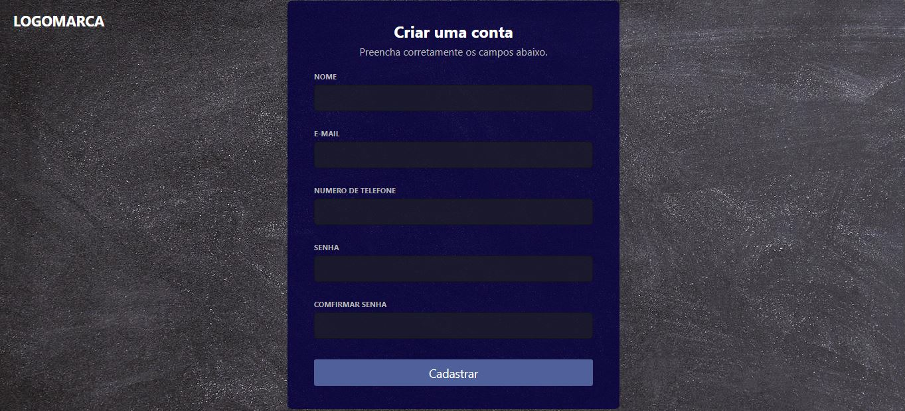
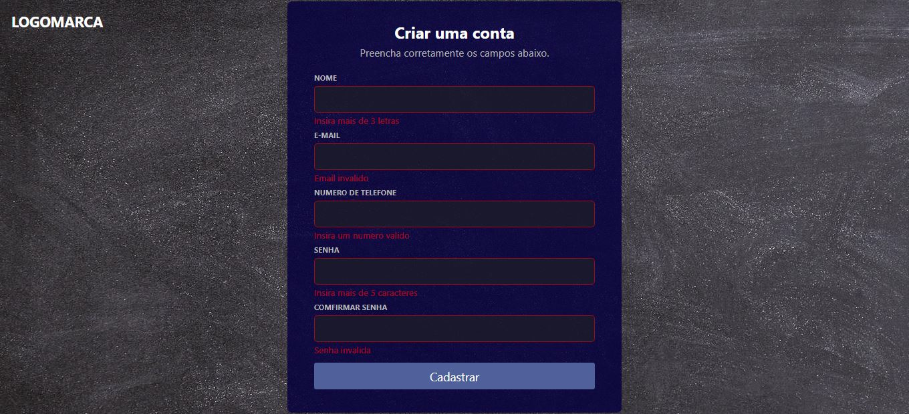

<h1 align="center">User Creation And Validation</h1>

# Readme

Registration page and login page. The registered data archived in local storage

<h4>Project in progress...</h4>

# Features
- [x] Register users
- [x] Authenticate users
- [x] Local storage
- [] QR code login

<h1>
    
</h1>

<h1>
    
</h1>

<h1>
    
</h1>

<h1>
    
</h1>

# Prerequisites
To start you need to have the [Git](https://git-scm.com/) tool installed on your machine. It is also necessary to have an editor to work with the code as [VSCode](https://code.visualstudio.com/).

### Technologies
- HTML
- CSS
- [JavaScript](https://www.javascript.com/)

---

Made by GUTEMBERG OLIVEIRA. - [See my linkedin.](https://www.linkedin.com/in/gutemberg-oliveira-61a1b1116/)
